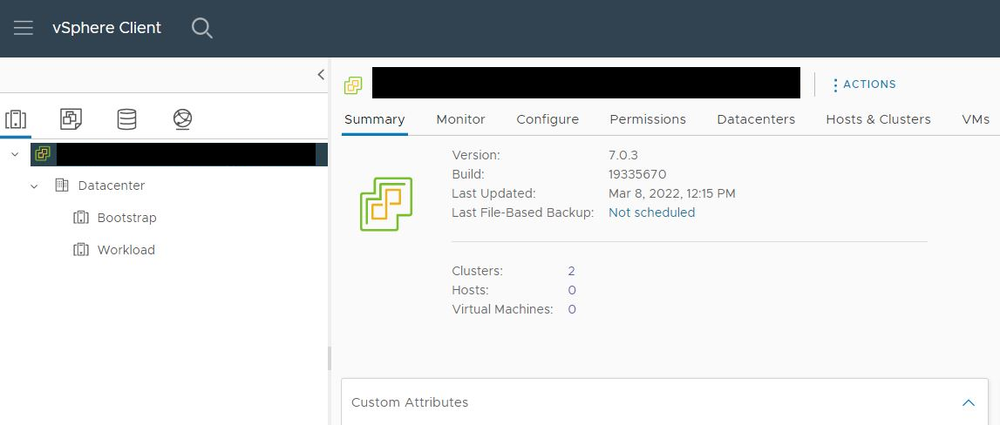
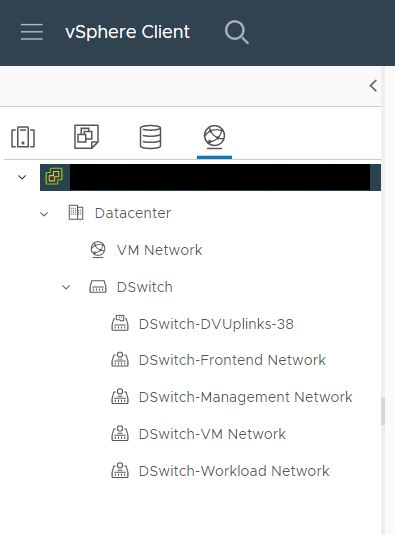
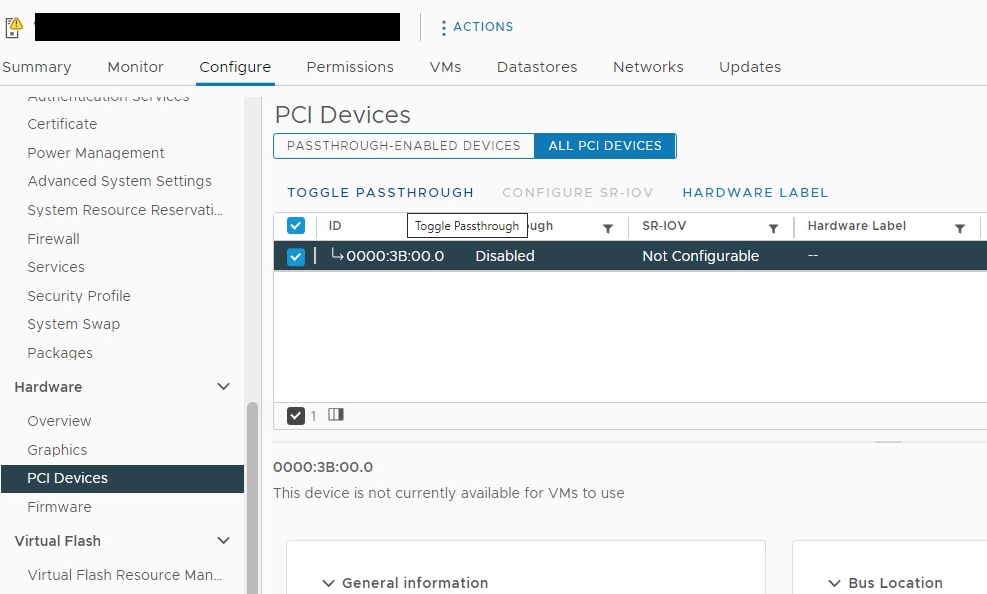

# Tanzu/Kubernetes vmaccel deployment scripts

The following instructions are for the Virtual Distributed Switch (VDS) configuration, assuming a fresh install of ESXi and VC.

## Prerequisites

### Infrastructure Prerequisites

#### Hosts

* Small or larger VCenter 7.0 U3c+ Deployment
  - VC should reside on the same VLAN as the Management network
  - Medium or larger is recommended with locality to hosts due to VC interop
* One host with 8+ CPUs and 64+ GB of RAM for Workload Management
* 3+ ESXi Storage/Workload hosts running vSphere 7.0 U3c+ (vSphere Workload Management and HCI Mesh):
  - 2+ Physical NIC adapters with configured vmknics for ESXi Management and TKG Management/Frontend/Workload traffic
  - No bound VMkernel Network Adapters
    - esxcli network ip interface list
    - esxcli network ip interface remove -i=vmkX
  - Default vSwitch with default portgroups
    - Assumes Distributed Virtual Switch specified in deploy.json does not exist yet
    - esxcli network vswitch standard list
    - esxcli network vswitch standard portgroup remove -p VMkernel -v vSwitch0
  - Non-empty password
  - SSH access

#### Network

* VLAN for Management network with routes to ESXi Hosts and VC
* VLAN(s) for a Workload and Frontend networks, separate from the Management network
  - Use a single VLAN at own risk as all Workload and Frontend traffic will be visible to ethernet devices on the same VLAN
* Static IP in the Management and Frontend/Workload networks for the Frontend/Control Plane Assigned to HA Proxy
* Virtual Static IP range in the Frontend network VLAN for Load Balancing the Frontend/Control Plane
* Workload Static IP range in the Workload network VLAN

#### Storage

* Shared storage using one or more of the following:
  - NFS Datastore
  - vSAN Datastore Deployment Requirements for 2+ Fault Domains

### Software Prerequisites

* Ansible Playbook (localhost)
* vSphere Enterprise Plus with Add-on for Kubernetes license
* vCenter Server Standard license
* VSAN Enterprise Plus license (if using vSAN Datastore shared storage)

## Instructions

If you have a pre-built cluster with DRS, HA, and vSAN configured, skip to step 10.

1. Setup download directory

``` shell
    $ mkdir -p downloads
```

2. Download the GoVC binaries for VC orchestration

``` shell
    $ wget -P $(pwd)/downloads https://github.com/vmware/govmomi/releases/download/v0.27.4/govc_Linux_x86_64.tar.gz
    $ tar -zxvf downloads/govc_Linux_x86_64.tar.gz -C $(pwd)/downloads
    $ cp downloads/govc .
    $ chmod a+x govc
```

3. Download HA Proxy (alternative to NSX Load Balancer)

``` shell
    $ export HAPROXY_OVA_URL=https://cdn.haproxy.com/download/haproxy/vsphere/ova/haproxy-v0.1.9.ova
    $ wget -P $(pwd)/downloads $HAPROXY_OVA_URL
```

4. Fill out the pertinent information in deploy.json and hosts

5. Create a Datacenter and Cluster

``` shell
    $ ansible-playbook -i hosts cluster-setup.yml -e "@deploy.json"
```

Verify the Bootstrap and Workload clusters are created in the Datacenter.



Verify the <b>vk8s-storage</b> tag and <b>vk8s-storage-policy</b> policy are created.

6. Setup the network for TKG

``` shell
    $ ansible-playbook -i hosts network-setup.yml -e "@deploy.json"
```



7. Add the Workload hosts to the Workload Cluster and configure any GPU and Passthrough devices with Hardware Label



8. Setup the hosts in the Cluster and synchronize time

``` shell
    $ ansible-playbook -i hosts hosts-setup.yml -e "@deploy.json"
```

9. Enable features for the Cluster

``` shell
    $ ansible-playbook -i hosts cluster-enable.yml -e "@deploy.json"
```

10. After some time your Datacenter should have a Workload cluster that includes the workload-hosts in the hosts file. The Workload cluster should have vMotion, HA, and vSAN licensed (if applicable) and enabled.

11. If vSAN is not being used as a Shared Datastore, then goto Step 12.

If using vSAN acknowledge/clear any warnings and verify VSAN operation, and verify vsanDatastore has backing storage. If desired, claim the unclaimed disks by Configuring the Workload Cluster: Configure -> vSAN -> Disk Management

Verify the vSAN datastore by creating a "New Folder"

12. Assign the <b>vk8s-storage</b> tag to the Shared Datastore.

13. With the hosts in the cluster configured, the Shared Datastore is available to create the content libraries, VM strorage, and upload the associated images. Execute the following script to configure the storage for Workload Management:

``` shell
    $ ansible-playbook -i hosts storage-setup.yml -e "@deploy.json"
```

14. Deploy the HA Proxy Load Balancer as follows:

``` shell
    $ ansible-playbook -i hosts load-balancer-setup.yml -e "@deploy.json"
```

15. PowerOn the HA Proxy and wait for the HA Proxy to come online and ping the Load Balancer virtual IPs to verify functionality.

16. Get the certificate from the HA Proxy

``` shell
    $ scp root@<HA Proxy>:/etc/haproxy/ca.crt .
```

17. Enable Workload Management...

...

~15 minutes later the Supervisor Cluster should be running.

18. Create a Namespace...

19. Create a devops user under <i>Menu -> Administration -> Users and Groups</i>

20. Under the Permissions tile, provide Group/User permissions using the devops user

21. Under the Storage tile, add the <b>vk8s-storage-policy</b> storage policy

22. Under the VM Service tile, create and associate a VM Class by clicking "MANAGE VM CLASSES"

23. Under the VM Service tile, associate a Content Library by clicking "MANAGE CONTENT LIBRARIES"

24. Download and install the CLI Tools from the UI

25. Create a Tanzu Kubernetes Cluster

## Troubleshooting

If a session is active or multiple VC servers are being used, you must delete the cached sessions in ~/.govmomi/rest_sessions ~/.govmomi/sessions

## Further Reading

* Configuring vSwitch from the command line - https://kb.vmware.com/s/article/1008127
